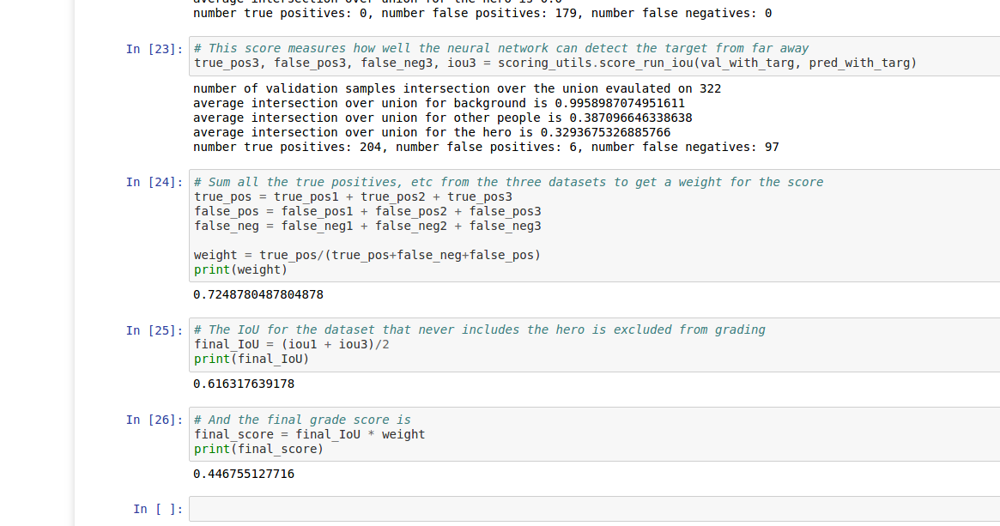
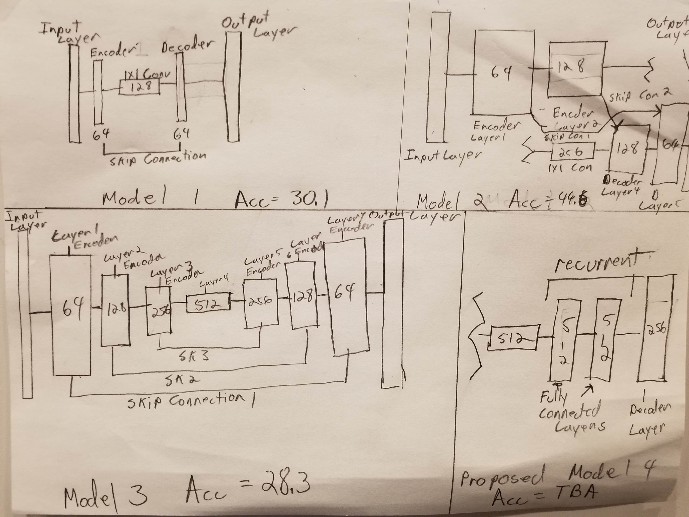

#Submission 2:

##The student is demonstrates a clear understanding of 1 by 1 convolutions and where/when/how it should be used:

Convolutional layers by themselves are nothing more than linear classifiers. 1 x 1 convolutions allow one to introduce non linear classification between convolutional layers. They act as a fully connected layer. This allows the data seperation boundaries to be "curved" towards a more perfect fit.

##The student demonstrates a clear understanding of a fully connected layer and where/when/how it should be used:

A fully connected layer is a layer where every node, is connected to every node in the next layer. Fully connected layers are non-linear classifiers that allow one to draw highly complex seperation lines between multiple types of data. Fully connected layers tend to do best when trained on labeled data; I.E learning that is fully supervised. This is becuase multilayered perceptrons depend heavily of back propegation; the calculation of the partial derivative distance between the layer prediction and the actual label.

#The student is able to clearly articulate whether this model and data would work well for following another object (dog, cat, car, etc.) instead of a human and if not, what changes would be required.

I believe the classifier would struggle in such a situation. While its layers may contain classifiers that allow it rule out "crowd" objects. I would lack the ability to identify the actual target due to the fact that it would be unable to identify it's feature.


# Deep Learning - Follow Me Project

This is the my submission repository for my Robot arm pick and place project.

# Introduction

The purpose of the project was to collect data for a train a fully-convolutional network that would enable a drone to identify a particular target "person" and track them.

# Data collection: 

For the data collection part of this project, I created a patrol circuit around the enviroment's parkinglot area. The circuit consisted three loops, one at ground level, one at twice "person hieght" abouts and one at simulation starting level. Inside the patrol circiut I created a zigzagging hero patrol path and a number of spawn pionts interspersed around the hero path. I then recorded the simulation for three hours obtaining a collection of 4100 images. This I deposited in run 1. 

My technique for collecting data, had some strengths and weaknesses. For one, the ground level images might have actually degraded the accuracy of my model, because the test drone always remains at the same height. Furthermore a more, concentrated collection area would have improved my model's ability to identify the target in a crowd. That said, my data set contains a large number of images of the target at a distance; which may have improved the model's ability to identify targets at a distance. Hopefully, have 4100 extra training images would improve the model's performance overall. 


# Network Architectures and training:

The base network provided in the project is a fully connected convolutional network with skip layers. For this project, I acctualy first tried running the data through a 6 connected layer NN neural network in order to get a basline accuracy. My 7 epoch run wasn't bad and managed an accuracy of 17 percent. Adding two droput layers, set at 0.5 in layers 2 and 0.8 in 4 added 5 percent more accuracy after only 5 epochs. 

For curiosity sake, I ran the input data through a mixed constitutional/fully connected network with two convolutions, one pooling layer, two dropouts and two fully connected layers at the end. While I recognised that the pooling layers would obscure the position of the hero target, I realized the overall test was to identify the hero shape in the picture rather than the hero's position. This actually worked quite well and I managed an accuracy of 47 percent after only 8 epochs. That said, I doubt that the overall model would have been actually useful for actual navigation as it would have been good at detecting the hero but not the hero's position.

```{python}:

model = Sequential()
model.add(Conv2D(32, kernel_size=(3, 3),
                 activation='relu',
                 input_shape=input_shape))
model.add(Conv2D(64, (3, 3), activation='relu'))
model.add(MaxPooling2D(pool_size=(2, 2)))
model.add(Dropout(0.5))
model.add(Flatten())
model.add(Dense(128, activation='relu'))
model.add(Dropout(0.8))
model.add(Dense(num_classes, activation='softmax'))

``````

Next up, I began using the fully constitutional layers as dictated by the actual project work space; see Figure below. For my first run, I ran a simple one encoder, 1x1 conv layer and one decoder layer model with a single skip layer between the encoder and decoder. After 10 epochs I achieved an accuracy of 30.1 percent with the base parameters. tuning the learning rates, batch sizes and step per epoch parameters yields marginal changes in accuracy; withing 5% up or down. 

For Model 2, I added an additional, encoder, decoder and skip lip layer. With a batch size of 64 and a learn rate of 0.001 I achieved an accuracy rate of 44 percent.



Model 3, added an additional encoder and decoder layer. Oddly enough this architecture did not work so well and my accuracy dropped to 28.3 percent for 10 epochs and 32 percent for 20. Due to time constraints, I am unable to provide results from my next model. That said I currently working on a models with a two layer recurrent fully connected layer embedded between the encoders and decoders just after the the 1 by 1 convolution. It is hoped ,that by adding the RNN between the encoder and decoders, that the decoders may gain some sense of time in their computations. This may help the NN to track the target more effectively by allowing it to predict where it should look to find the target in the next image. 


These models were primarily trained on my MSI GE 70 with I7 3.5 Gh cpu and an Nvidia 1080 GTX. It took an average of 6 hours to train each model. My last model was trained on AWS as the extra layers added a considerable spike in computation time. 

#Conclusion:

It seems pretty clear ,that for this assignment, architecture was king. All the biggest jumps in performance, came from fundamentally changing my architecture design. That said, I was ALSO able to gain some performance improvements by adjusting parameters. Generally speaking, most improvements came from, adding layers, lowering the learning rate, and increasing the number of epochs, beyond 10, in that order. Though often a smaller learning rate resulted in more epochs being needed.  

Ultimately though, any particular archetecture on any particular data set seemed to have some sort of limit as to how accurate it could get. Adding more and more refinements to a model seemed to produce dimineshing results. This suggested to me the existance of a finite limit of accuracy for any particular model/data set combo. 

Were I to spend more time on this project, I would first go back and try to collect a different data set using different collection conditions. I would then train my previous models on the new data set and compare the results. I would also RETRAIN my old saved NNs to see if the new data added to the accuracy of the old. Finally I would begin to look at ways of improving my models with new architectures. perhaps a CNN with a RNN tacked on to the end.
